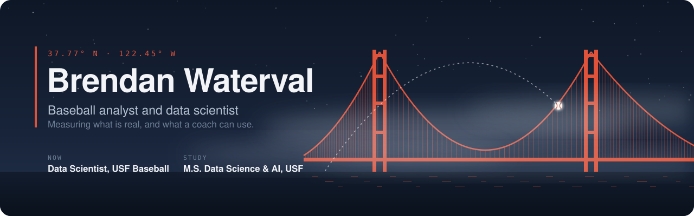

  
  
  

Data Scientist (graduate practicum) with **USF Baseball**, M.S. in Data Science and AI at the University of San
Francisco, B.S. in Computational Modeling and Data Analytics from Virginia Tech, where I spent three years on the
student baseball analytics team.

### The questions I care about

- **Is the number real?** Does it hold up when a player changes teams, and does it beat last year's stat at
  predicting next year?
- **What is it actually measuring?** A framing grade can be the catcher, the park, or the umpire. A pitch type can
  be the pitch or the person running the TrackMan.
- **Would a coach change a decision because of it?** If not, it stays a research note.

### Public work

| | Project | What it shows |
|:-:|---|---|
| ⚾ | **[draft-intelligence](https://github.com/Brendanw1/draft-intelligence)** | MLB Draft projections for 10,734 NCAA D1 prospects from public data. Rolling year-out backtests beat a naive pick baseline by 17%, a live check on the 2026 draft, and a career WAR model held back because it failed its own release gates. |
| 🎥 | **[pitch-tipping](https://github.com/Brendanw1/pitch-tipping)** | Pose estimation (MediaPipe) on pitcher stance images to flag tipped pitches. |
| 🏀 | **[capstone-play-calls](https://github.com/Brendanw1/capstone-play-calls)** | Live sideline play-call console that Virginia Tech men's basketball used during games, replacing pen and paper (team capstone). |

### Private work

Built on TrackMan and team data, so the code and data stay private. Aggregate write-ups are in progress.

- **BaseballGOAT**: pitcher and hitter evaluation on 7.1M D1 TrackMan pitches. In college, the same pitch gets a
  different name 22% of the time depending on the ballpark's operator, so I adapted a topological pitch tagger
  (Maloof et al., 2026) and showed that grading pitches by class beats grading them by tag.
- **D1 defensive metrics**: framing, catcher arm, blocking, and range in runs saved, tested on players who changed
  teams and against official NCAA stats.

### Toolkit

`Python` `R` `SQL` `DuckDB` `LightGBM` `XGBoost` `mgcv` `brms/Stan` `Shiny` `Next.js` · `TrackMan` `Blast Motion`
`TruMedia` `Statcast`

